<p align="center">
  
</p>

<h1 align="center">Lu Yipeng</h1>

<p align="center">
  <strong>AI Education Founder / Full-stack Builder / Backend-first Engineer</strong>
  <br />
  Building <a href="https://huoyue.online">Huoyue.online</a> with a small, high-ownership team across Fudan, HIT, ByteDance and Tencent.
</p>

<p align="center">
  <a href="https://github.com/Lu-Yipeng"></a>
  <a href="https://huoyue.online"></a>
  
  
</p>

---

### What I am building now

I am currently working full-time on **Huoyue**, an AI education platform designed around a simple belief:

> Better learning happens when matching, communication, teaching context and intelligent agents work as one system.

The product is being built around four core layers:

| Layer | What we are shipping |
| --- | --- |
| **Algorithmic matching** | Matching teachers and students by learning goals, teaching style, availability and long-term fit. |
| **Online IM system** | Real-time messaging, consultation flow, learning context retention and operational workflows. |
| **Live video classroom** | Low-friction real-time teaching with class-state awareness and collaboration primitives. |
| **Multi-agent interaction** | Agents that assist planning, tutoring, feedback, operation and learning path iteration. |

I act as both **product owner and core developer**, moving between user research, product decisions, backend architecture, frontend implementation and release execution.

### Background

- Backend-first engineer with production-oriented experience in **Java / Go / Spring Boot / Gin / MySQL / Redis / MQ**.
- Built complete web products end to end, from product design and architecture to deployment.
- Previously interned in AI core teams at **Bilibili** and **ByteDance**.
- Comfortable with both backend systems and modern frontend application development with **Vue / React**.
- Currently leading a compact team made up of students from **Fudan University** and **Harbin Institute of Technology**, plus engineers from **ByteDance** and **Tencent**.

### How I build

I care about fast product iteration, but not the fragile kind.

- **Vibe coding as exploration**: use AI-assisted development to quickly discover product shape, edge cases and interface possibilities.
- **TDD as compression**: turn uncertain behavior into executable constraints before the system grows too large to reason about.
- **Small team, high agency**: keep ownership clear, ship useful increments, and let feedback reshape the plan.
- **Engineering for landing**: prefer simple deployable systems over impressive diagrams that do not survive users.

### Current learning stack

I am deepening my work around AI systems engineering:

```text
Transformer internals  ->  KV Cache  ->  RAG  ->  Multi-Agent Workflow
MCP / tool calling     ->  inference frameworks  ->  productized AI systems
```

At the same time, I am exploring **Web3 and smart contracts**:

```text
Solidity  ->  EVM  ->  contract interaction  ->  AI + Web3 product ideas
```

### Technical surface area

```yaml
Backend:
  - Java, Go, Spring Boot, Gin
  - MySQL, Redis, Message Queue
  - API design, auth, distributed system basics

Frontend:
  - Vue, React, TypeScript
  - Product UI, dashboards, real-time interaction

AI Systems:
  - RAG, AI Agent workflow, MCP
  - model inference concepts, evaluation loops

Product:
  - education matching systems
  - online teaching workflows
  - rapid prototyping, TDD, deployment
```

### Projects I want to explore

- Agent-native tools for education operations and personalized learning.
- AI-assisted software teams with stronger testing, review and product feedback loops.
- Web3 experiments where smart contracts become useful product primitives, not decoration.
- Developer tools that make small teams feel unusually capable.

---

<p align="center">
  <strong>Building useful AI products, one shipped system at a time.</strong>
  <br />
  <a href="https://huoyue.online">huoyue.online</a> · <a href="https://github.com/Lu-Yipeng">github.com/Lu-Yipeng</a>
</p>
